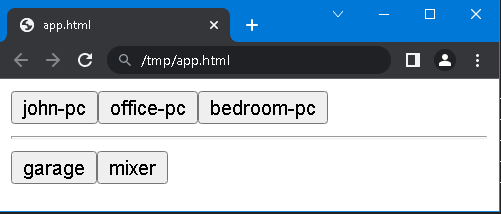

# ManyVNC-Launcher
A light-weight vnc launcher

This is a quick nodejs based vnc launcher for tigervnc.

Run start.  When the browser opens it will show buttons for your computers.  Clicking them will log you into those vnc machines.  Just a time-saver really.

Note, you'll need to install nodejs, exo-open and a browser of your choice.
